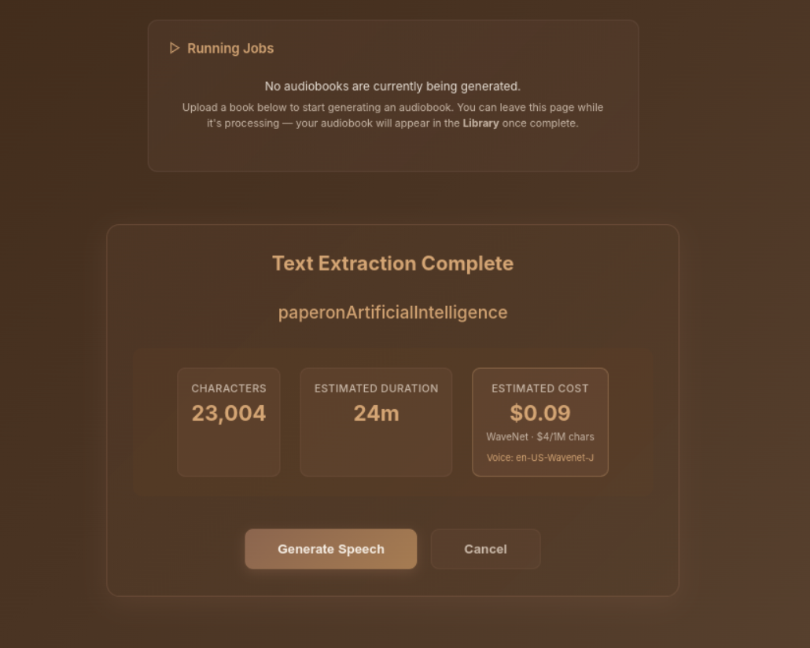
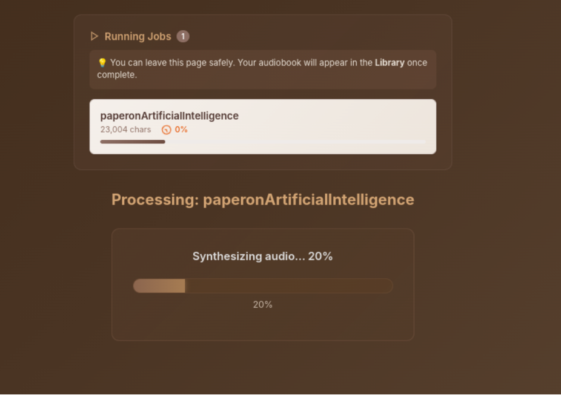
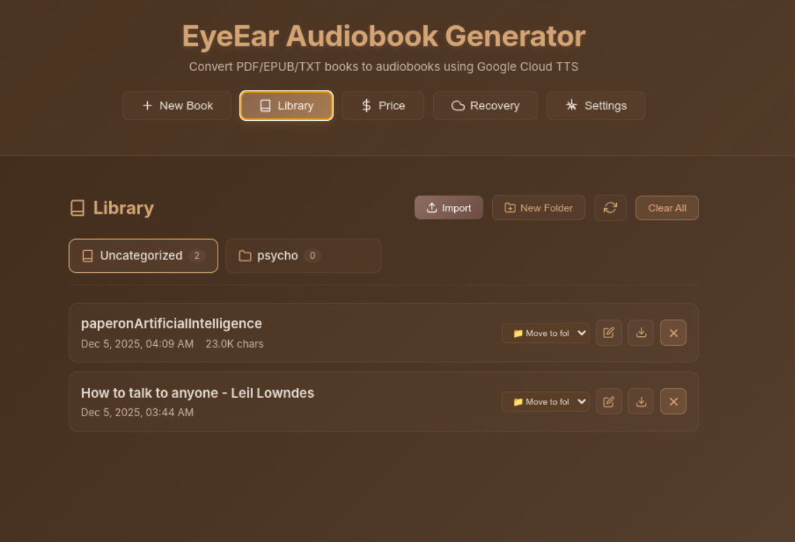
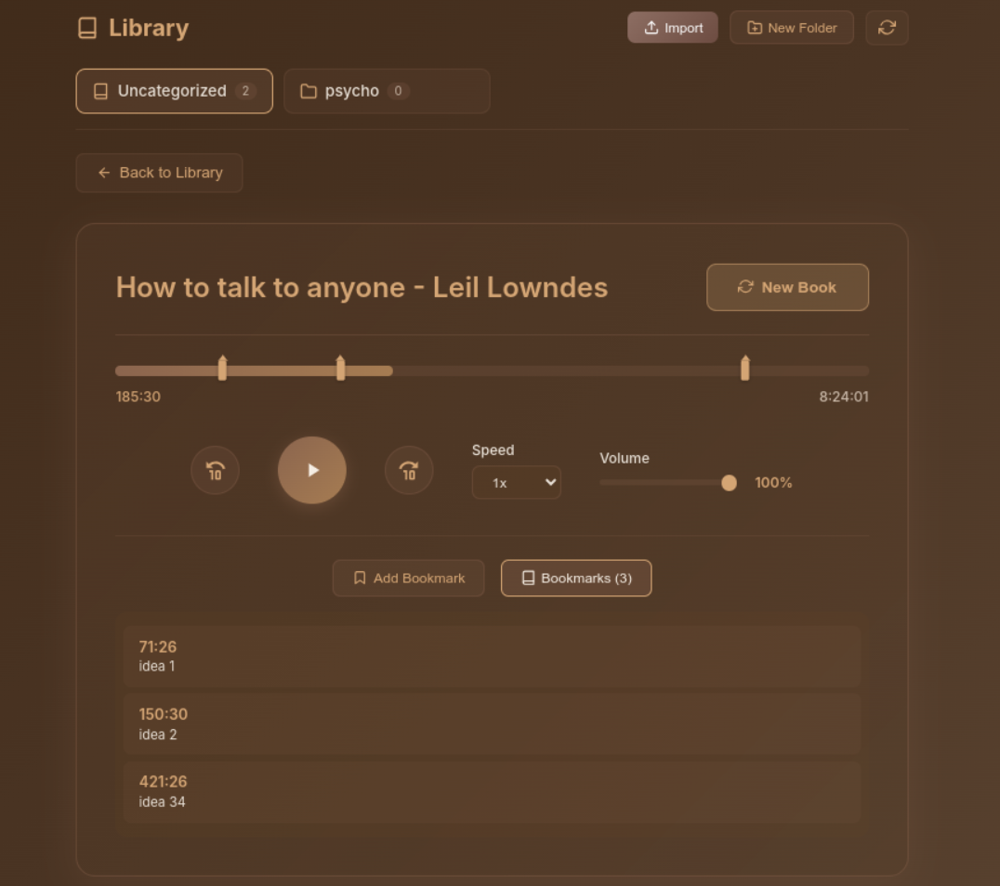
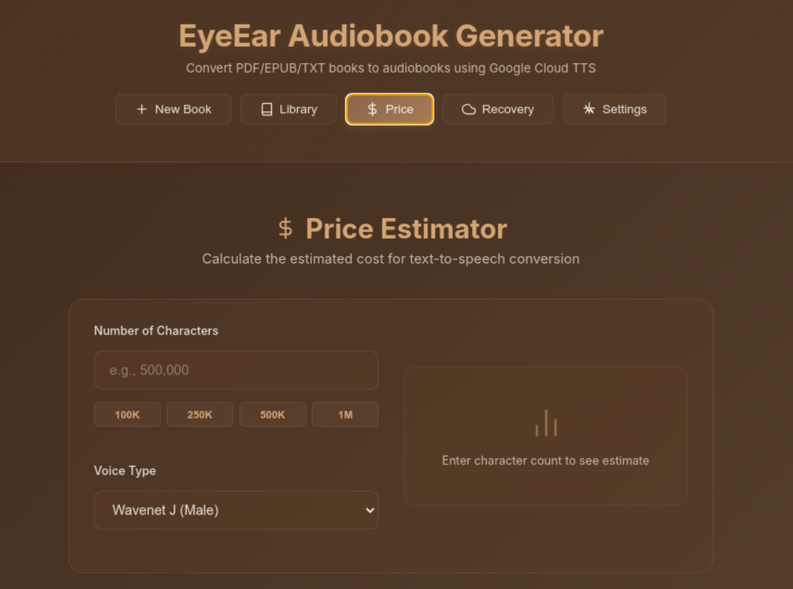
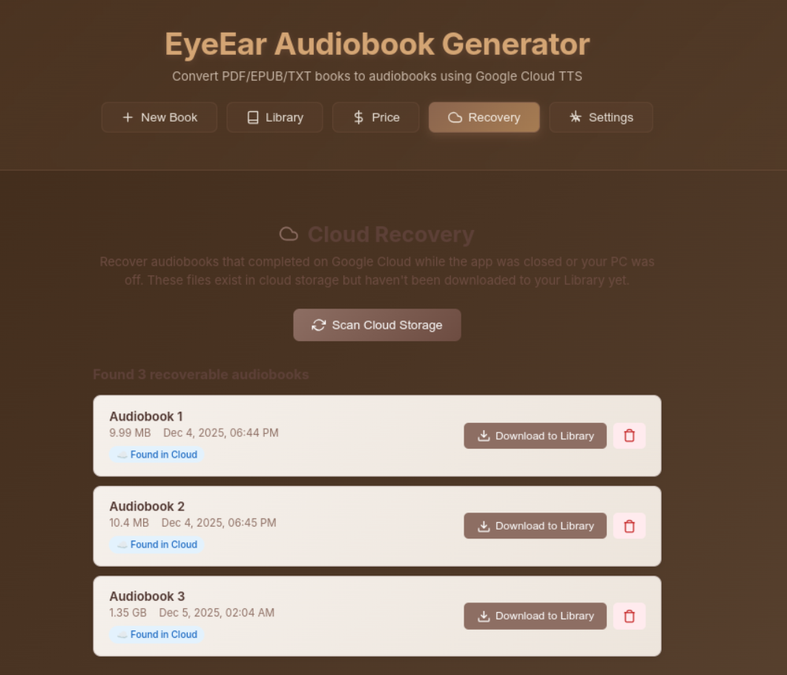
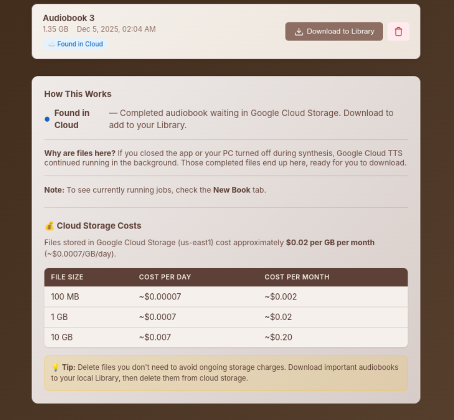
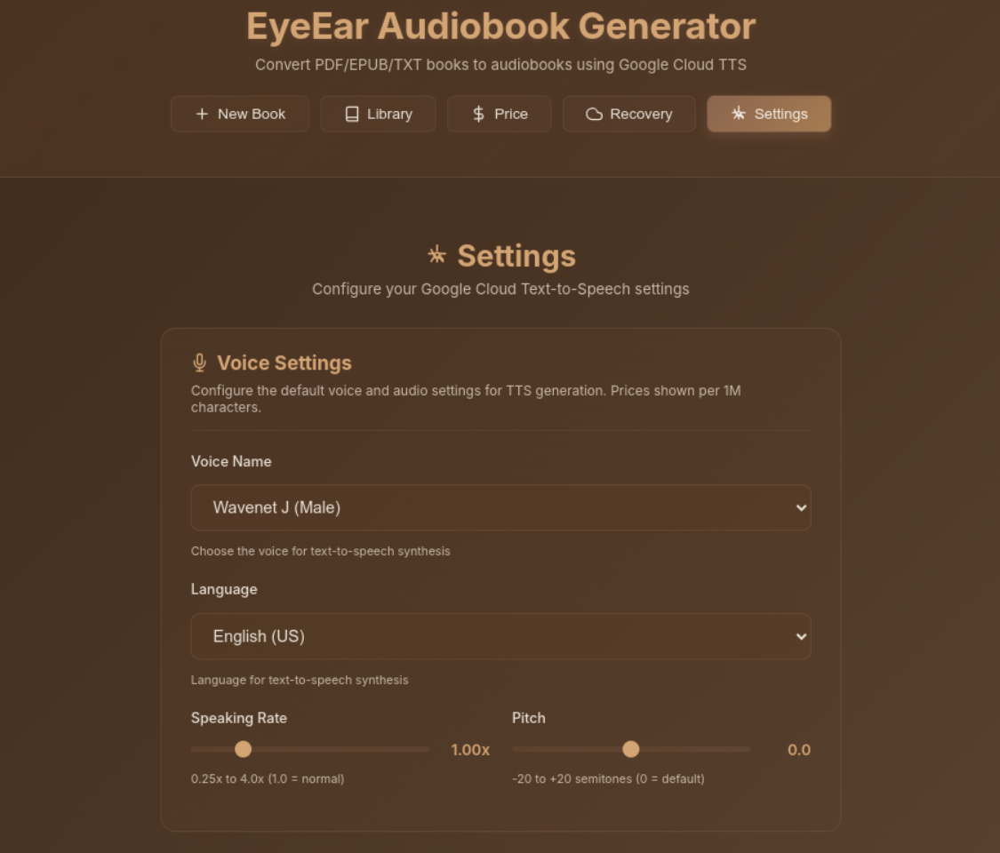
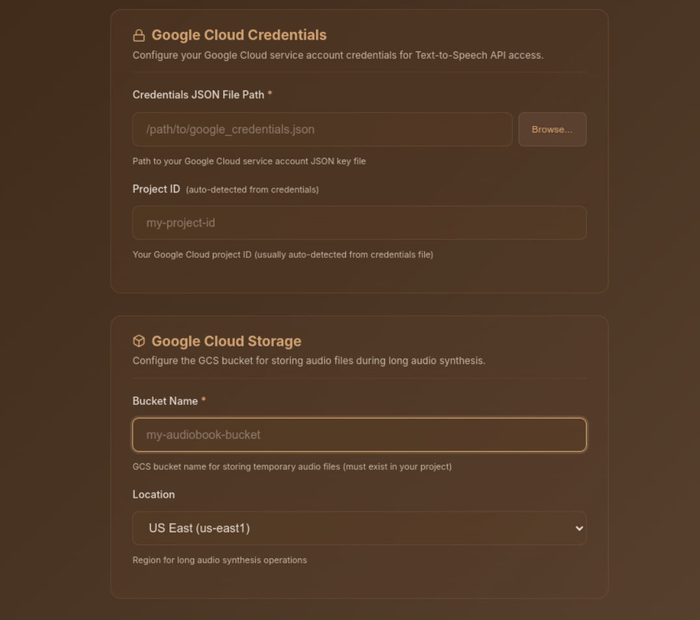

# 👁️👂 EyeEar Audiobook Generator

Convert your PDF, EPUB, and TXT files into high-quality audiobooks using Google Cloud Text-to-Speech.


## 🎧 Voice Sample

Listen to a sample generated with WaveNet voice:

https://github.com/user-attachments/assets/d1d3a822-9dfa-41e9-aad2-a35190dddd40

[⬇️ Download MP3](wavenet_voice_sample.mp3)
## Sneak Peek


&nbsp;



&nbsp;



&nbsp;



&nbsp;



&nbsp;



&nbsp;


&nbsp;



&nbsp;



&nbsp;



&nbsp;



&nbsp;


## ✨ Features

- **Multiple File Formats** - Support for PDF, EPUB, and TXT files
- **Premium Voice Quality** - Access to Google Cloud's Chirp 3 HD, Studio, Neural2, WaveNet, and Standard voices
- **40+ Languages** - Generate audiobooks in English, Spanish, French, German, Japanese, and many more
- **Library Management** - Organize your audiobooks with folders, rename books, and download MP3s
- **Bookmarks** - Save your place with persistent bookmarks that sync across sessions
- **Price Estimator** - Calculate costs before generation with the built-in price calculator
- **Adjustable Settings** - Control speaking rate (0.25x-4x) and pitch (-20 to +20 semitones)
- **Progress Tracking** - Real-time progress updates during audio generation
- **Audio Player** - Built-in player with playback speed control, volume, and seeking

## 🖥️ System Requirements

- **OS**: Ubuntu 20.04+ (or other Linux distributions)
- **Node.js**: v18 or higher
- **NPM**: v8 or higher
- **FFmpeg**: Required for audio processing

## 📦 Installation

### 1. Clone the repository

```bash
git clone https://github.com/yourusername/eyeear-audiobook.git
cd eyeear-audiobook
```

### 2. Install dependencies

```bash
npm install
```

### 3. Install FFmpeg (if not already installed)

```bash
sudo apt update
sudo apt install ffmpeg
```

### 4. Set up Google Cloud (see Configuration section below)

### 5. Run the app

**Option A: Using the launcher script (recommended)**
```bash
./eyeear.sh
```

**Option B: Using npm**
```bash
npm run dev:all
```

## ⚙️ Configuration

### Google Cloud Setup

EyeEar uses Google Cloud Text-to-Speech API. You'll need to:

1. **Create a Google Cloud Project** at [console.cloud.google.com](https://console.cloud.google.com)

2. **Enable the Text-to-Speech API**
   - Go to APIs & Services → Library
   - Search for "Cloud Text-to-Speech API"
   - Click Enable

3. **Create a Service Account**
   - Go to IAM & Admin → Service Accounts
   - Click "Create Service Account"
   - Grant the following roles:
     - Cloud Text-to-Speech API User
     - Storage Object Admin
     - Storage Object Creator
     - Storage Object Viewer

4. **Download the JSON key**
   - Click on your service account
   - Go to Keys → Add Key → Create new key → JSON
   - Save the file to a secure location (e.g., `~/.eyeear/google_credentials.json`)

5. **Create a GCS Bucket**
   - Go to Cloud Storage → Buckets
   - Create a new bucket for storing temporary audio files
   - Note the bucket name

6. **Configure EyeEar**
   - Open the app and go to Settings
   - Enter the path to your credentials JSON file
   - Enter your bucket name
   - Select your region
   - Click "Test Connection" to verify
   - Click "Save Settings"

## 🎯 Usage

### Creating an Audiobook

1. Click **"New Book"** in the navigation
2. Drag & drop or click to upload a PDF, EPUB, or TXT file
3. Review the extraction preview (character count, estimated cost)
4. Click **"Generate Speech"**
5. Wait for processing (progress shown in real-time)
6. Listen to your audiobook in the built-in player!

### Managing Your Library

- **📚 Library** - View all your generated audiobooks
- **📁 Folders** - Create folders to organize your books
- **✏️ Rename** - Click the pencil icon to rename any book
- **⬇️ Download** - Download audiobooks as MP3 files
- **🔖 Bookmarks** - Save your place while listening

### Price Estimator

Use the **💰 Price** tab to calculate costs before generating:

| Voice Type | Per 1M Characters |
|------------|-------------------|
| Standard & WaveNet | $4 |
| Neural2 & Polyglot | $16 |
| Chirp 3 HD ⭐ | $30 |
| Studio | $160 |

## 📁 Supported File Formats

| Format | Description |
|--------|-------------|
| `.pdf` | PDF documents (text-based and OCR for scanned) |
| `.epub` | E-book format |
| `.txt` | Plain text files |

## 🎙️ Available Voices

EyeEar provides access to 100+ voices across categories:

- **Chirp 3 HD** - Premium natural-sounding voices (recommended for audiobooks)
- **Studio** - Professional studio-quality voices
- **Neural2** - High-quality neural network voices
- **WaveNet** - Natural-sounding voices
- **Standard** - Basic text-to-speech voices

Languages include: English (US, UK, AU, IN), Spanish, French, German, Italian, Portuguese, Japanese, Korean, Chinese, Hindi, Arabic, Dutch, Russian, Polish, Turkish, Swedish, Norwegian, Danish, Finnish, Greek, Hebrew, Czech, Romanian, Hungarian, Ukrainian, Vietnamese, Thai, Indonesian, and more.

## 🛠️ Development

### Project Structure

```
eyeear-audiobook/
├── electron/           # Electron main process
│   ├── main.js        # Main Electron entry
│   └── preload.js     # Preload script
├── src/               # React frontend
│   ├── components/    # React components
│   ├── App.jsx        # Main app component
│   └── index.jsx      # Entry point
├── backend/           # Express backend
│   ├── server.js      # Express server
│   ├── routes/        # API routes
│   └── services/      # Business logic
├── assets/            # App icons
├── data/              # Persisted data (settings, history)
├── temp/              # Temporary upload files
├── output/            # Generated audiobooks
└── eyeear.sh          # Launcher script
```

### Running in Development Mode

```bash
# Run all services (React + Electron + Backend)
npm run dev:all

# Or run individually:
npm run dev:react     # Vite dev server (port 5173)
npm run dev:backend   # Express server (port 3001)
npm run dev:electron  # Electron app
```

### Building for Production

```bash
npm run build
```

## 🐛 Troubleshooting

### "SUID sandbox helper binary" error
This is a Linux sandbox issue. The launcher script handles this automatically, or you can run:
```bash
ELECTRON_DISABLE_SANDBOX=1 npx electron --no-sandbox .
```

### Port already in use
Kill existing processes:
```bash
fuser -k 3001/tcp
fuser -k 5173/tcp
```

### Audio not playing
- Check that FFmpeg is installed: `ffmpeg -version`
- Verify the audio file exists in the `output/` directory
- Check browser console for errors

### Google Cloud errors
- Verify your credentials file path is correct
- Ensure the Text-to-Speech API is enabled
- Check that your service account has the required permissions
- Verify your bucket exists and is accessible

## 📄 License

MIT License - feel free to use and modify!

## 🙏 Acknowledgments

- [Google Cloud Text-to-Speech](https://cloud.google.com/text-to-speech) for the TTS API
- [Electron](https://www.electronjs.org/) for the desktop framework
- [React](https://reactjs.org/) for the UI framework
- [Howler.js](https://howlerjs.com/) for audio playback
- [pdf-parse](https://www.npmjs.com/package/pdf-parse) for PDF text extraction
- [epub](https://www.npmjs.com/package/epub) for EPUB parsing

---

Made with ❤️ for audiobook lovers
